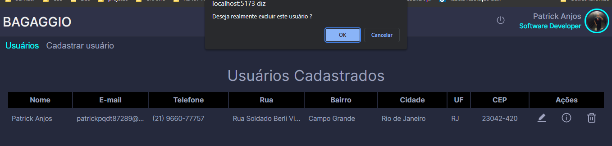
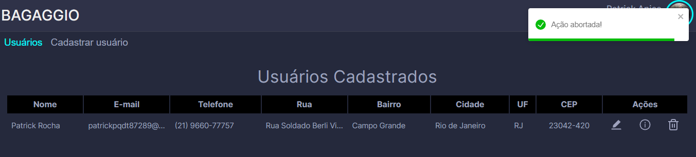
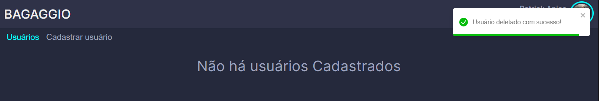

# Desafio BAGAGGIO
<a href="https://64a2c8fe13d46c0b265483da--gleaming-manatee-2e1f4b.netlify.app/">DEPLOY</a>

# Linguagens para a realização

    ⚡ Javascript
    ⚡ HTML5
    ⚡ CSS3

# Desejável
    ⚡ ReactJS
    ⚡ NextJS
    ⚡ VueJS

## O Desafio 🔥

<p>
    
    Criar uma tela de login que faça a validação de um login existente no Github.<br/>
    Consultar a API do github para obter os dados do usuário.

    Ex: https://api.github.com/users/setxpro

    Ex: de uma tela de login a seguir...
</p>


## Exemplo da requisição 

| Função      | Método | Endpoint                               |
| ----------- | ------ | -------------------------------------- |
| **getUser** | GET    | `https://api.github.com/users/{usuario}` |

### Exemplo

Requisição:

```json
    GET
```

Resposta:

```json
{
  "login": "setxpro",
  "id": 69186374,
  "node_id": "MDQ6VXNlcjY5MTg2Mzc0",
  "avatar_url": "https://avatars.githubusercontent.com/u/69186374?v=4",
  "gravatar_id": "",
  "url": "https://api.github.com/users/setxpro",
  "html_url": "https://github.com/setxpro",
  "followers_url": "https://api.github.com/users/setxpro/followers",
  "following_url": "https://api.github.com/users/setxpro/following{/other_user}",
  "gists_url": "https://api.github.com/users/setxpro/gists{/gist_id}",
  "starred_url": "https://api.github.com/users/setxpro/starred{/owner}{/repo}",
  "subscriptions_url": "https://api.github.com/users/setxpro/subscriptions",
  "organizations_url": "https://api.github.com/users/setxpro/orgs",
  "repos_url": "https://api.github.com/users/setxpro/repos",
  "events_url": "https://api.github.com/users/setxpro/events{/privacy}",
  "received_events_url": "https://api.github.com/users/setxpro/received_events",
  "type": "User",
  "site_admin": false,
  "name": "Patrick Anjos",
  "company": "BAGAGGIO",
  "blog": "",
  "location": "Rio de Janeiro",
  "email": null,
  "hireable": null,
  "bio": "I am a kind of guy who likes programming at its core; excellent communication as well as leadership skills. Detail oriented and organized professional",
  "twitter_username": null,
  "public_repos": 55,
  "public_gists": 0,
  "followers": 16,
  "following": 16,
  "created_at": "2020-08-04T06:12:09Z",
  "updated_at": "2023-06-25T11:43:11Z"
}
```
<p>
    
    Após obter esses dados pela API o candidato deverá guardar essas informações do usuário no localstorage do navegador 
    para que seja feito o gerenciamento de estado. 

    EX: localStorage.setItem("usuario", object)
    objtc -> o corpo da requisição da API
</p>
<p>
    
    O usuário deve permanecer logado até que o mesmo queira se deslogar do sistema.<br/>
    Para isso, deverá o candidato usar o metodo localStorage.removeItem("usuario")<br/>
    removendo o usuário e o levando para a página de login.
</p>

```
OBS.: 
O usuário não poderá acessar a rota (página home) sem que esteja logado. 
para isso, deverá ser feito uma verificação no momento do login.

```

<p>

    O usuário deverá obter a resposta no corpo da requisição.
</p>

```
    EX: 

        try {
            requisição...
        }
        catch (error) {
            alert(error.response.data.message)
        }

    error.response.data.message -> forma de obter a resposta do servidor.

```
<p>

    Se não houver um usuário com esse login.
    o Github responderá com o status 404 -> com a mensagem - "Not Found"
</p>

---

PART 2
# Usuário autenticado. 🔐

<p>
   ⚡ CRUD
</p>
 
<p>
    
    deve ser preenchido com a foto do usuário e nome.
    a página home não precisa ser algo complexo.
</p>


# Home 🏠


<p>

    Nesse exemplo a página home será preenchida quando um usuário for cadastrado.
</p>

# Cadastro de usuários 


<p>

    O usuário deverá preencher todos os campos.
</p>

```
OBS.: 

    Quando o usuário terminar de preencher o CEP.
    Deverá fazer uma requisição para a API do governo que disponibiliza
    gratuitamente no site.

    e preencher automaticamente os campos de rua, cidade e UF
```
<a href="https://brasilapi.com.br/docs#tag/Corretoras/paths/~1cvm~1corretoras~1v1/get">API BRASIL</a>

## Exemplo da requisição

| Função      | Método | Endpoint                               |
| ----------- | ------ | -------------------------------------- |
| **getAddress** | GET    | `https://brasilapi.com.br/api/cep/v1/{cep}` |

### Exemplo

Requisição:

```json
    GET
```

Resposta:

```json
{
	"cep": "25015575",
	"state": "RJ",
	"city": "Duque de Caxias",
	"neighborhood": "Parque Lafaiete",
	"street": "Rua Medeiros e Albuquerque",
	"service": "widenet"
}
```

# Cadastro de usuários


---

<p>

    Observe que na coluna "Ações" estão os metodos de editar, visualizar e deletar

</p>

# Tabela com o usuário cadastrado


---

# Editar Usuário ✏️


---

# Vizualizar usuário 👀


# Deletar usuário 🗑️

```
Teremos também o metodo de remoção do usuário. 
```
# Perguntando se desejo realmente excluir o usuário


# Abortando a ação clicando em cancelar


# Deletando o usuário


# Deploy
	
 Após a realização do teste:
 
Colocar a aplicação em produção.<br/>
 Sites onde você consegue realizar de forma gratuita:
  
<a href="https://vercel.com/login?next=%2Fsetxpro%2Freturn-frontend%2FGsS3TVaGGDXCDf76E2pTmzdHYZpu">Vercel</a><br/>
<a href="https://www.netlify.com/">Netlify</a><br/>
<a href="https://railway.app/">Railway</a><br/>

# OBS.:

```
O Desafio não precisa ser idêntico ao que foi mostrado como exemplo.
O desafio consistem em saber o nível de conhecimento do candidato acerca de consultas a APIs e gerenciamento de estado.  
```

<a href="https://64a2c8fe13d46c0b265483da--gleaming-manatee-2e1f4b.netlify.app/">DEPLOY</a>

Boa sorte! 💚⚡
